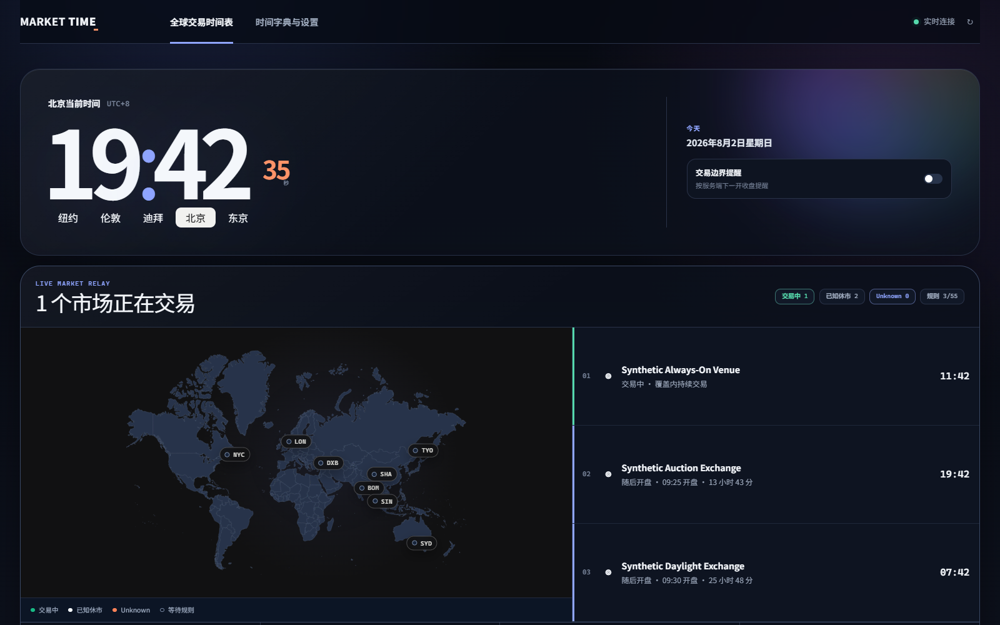
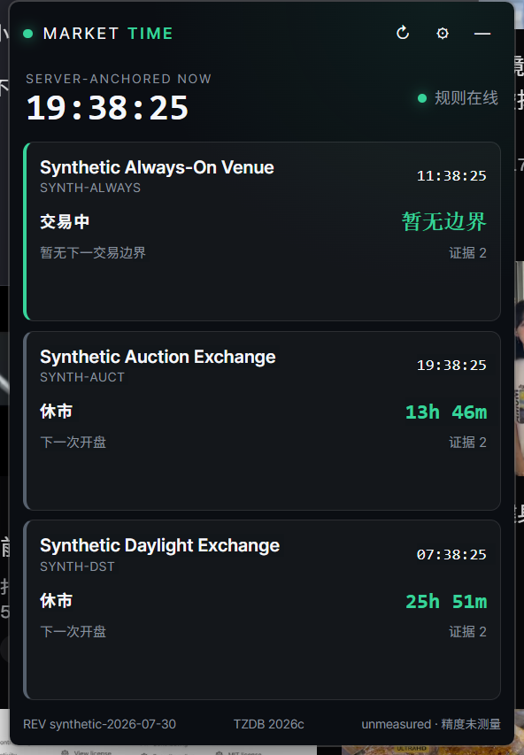
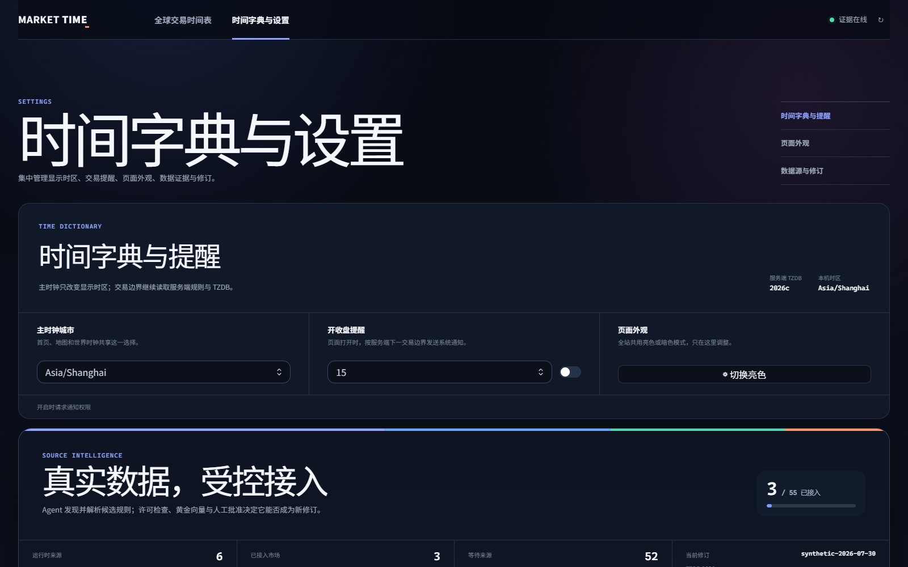

# Mark Time

Open-source, versioned, and auditable time infrastructure for global financial markets — with a
pure Rust engine, HTTP API, browser board, and an optional Windows desktop widget.

[](https://github.com/2233admin/market-time/actions/workflows/ci.yml)
[](https://github.com/2233admin/market-time/actions/workflows/release.yml)
[](https://github.com/2233admin/market-time/releases/latest)

## What it is

Mark Time answers one question with auditable precision: what time is it, and what is
open, where. It serves global city clocks, exchange trading sessions and phases, and
crypto funding and maintenance windows.

The repository currently ships four surfaces over the same rule output:

- **Rust core and CLI** for deterministic phase, timeline, and evidence queries.
- **HTTP service** for stable `/v1/status`, `/v1/timeline`, and venue catalog contracts.
- **Browser board** for a global, inspectable trading timetable and evidence settings.
- **Windows desktop widget** for an always-on-top market snapshot, server-derived countdowns,
  tray lifecycle, and optional per-market notifications.

The browser and desktop clients do not implement exchange calendars. They display validated
server answers, freeze the last trusted snapshot when the service is unavailable, and preserve
`known`/`unknown`, evidence, TZDB, and dataset-revision semantics at the edge.

## Screenshots

### Global market board



The board combines major financial-city clocks, a live-market relay, a draggable UTC inspection
axis, server-derived session timelines, and explicit rule coverage. Empty market tracks mean
"rules not configured" — never an inferred closed state.

### Windows widget and evidence settings

<table>
  <tr>
    <td width="38%">
      
    </td>
    <td width="62%">
      
    </td>
  </tr>
  <tr>
    <td><strong>Desktop widget.</strong> Compact, draggable, always on top, tray-managed, and honest when the service is offline.</td>
    <td><strong>Settings and evidence.</strong> Time-zone choice, reminder controls, appearance, source coverage, TZDB, and immutable revision identity.</td>
  </tr>
</table>

These screenshots use the repository's synthetic demonstration dataset. They do not contain or
imply redistributed venue schedules.

What sets it apart from an ordinary time/calendar library:

- **Every answer is traceable to dated source evidence.** A session boundary, a holiday,
  a funding window — each one points back to the document it came from and when that
  document was read.
- **Core instants are nanosecond-precision and unambiguous about their frame** — an absolute epoch
  instant, or a civil time bound to a named zone, never an implicit mixture of the two. UI clocks
  render at human scale and make no unsupported accuracy claim.
- **Uncertainty is stated, not guessed.** Where the data only supports a partial or
  provisional answer, Mark Time says so. Outside its verified coverage, it returns an
  explicit unknown rather than extrapolating a schedule.

## Who it is for

Machines first. Mark Time is infrastructure for **autonomous agents that trade**, and for other
systems that need to know what is open, where, and how far that answer can be trusted. People
reading the board are a legitimate second audience, not the design centre.

That ordering has a concrete consequence rather than being a slogan. A person looking at a board
can see that a number is fuzzy. **An agent cannot.** So uncertainty and unknown are not
presentation concerns here — they are part of the returned value, and the type system makes them
impossible to skip past. An agent that never inspects an answer's uncertainty still cannot
mistake an unknown for a closed market, because the two are different values rather than the same
value rendered differently. Anything a human would infer from how a screen looks has to survive
as data.

## Status

Early-preview MVP, and it runs. The phase engine, timeline query, dataset loader, CLI, HTTP
service, browser board, and Windows desktop widget are implemented and tested; what is not here,
and never will be, is venue data. The desktop MVP specification is in
[`openspec/changes/desktop-widget-mvp/`](openspec/changes/desktop-widget-mvp/), the original venue
state specification is in
[`openspec/changes/venue-session-state/`](openspec/changes/venue-session-state/); the research,
data model, and interface contracts behind it are in
[`docs/venue-session-state/`](docs/venue-session-state/).

## Download the Windows release

The [latest GitHub Release](https://github.com/2233admin/market-time/releases/latest) contains:

- an MSI installer for managed Windows deployment;
- an NSIS setup executable for ordinary desktop installation;
- a portable ZIP with `market-time-desktop.exe`, `market-time-server.exe`,
  `market-time.exe`, licenses, this README, and the synthetic demonstration fixture.

The installer installs the optional desktop client. The server remains a separate process by
design, because the widget only consumes stable HTTP rule output and never owns trading-session or
holiday calculations.

For a self-contained demonstration, extract the portable ZIP and run:

```powershell
.\market-time-server.exe --dataset .\fixtures\synthetic-venues.json
```

Then launch `market-time-desktop.exe`. The browser board is available at
<http://127.0.0.1:8080/>. Replace the synthetic fixture with an operator-owned dataset to answer
for real venues.

Release binaries are currently unsigned. Windows SmartScreen may therefore ask for confirmation;
verify the tag, repository, and attached SHA-256 checksum file before running them.

## Try it

The repository ships a **synthetic** dataset — three invented venues that exercise the three
structural cases (auctions plus a mid-day break, a daylight-saving zone whose open is a process,
an always-on venue with scheduled events). It is not any real venue's calendar, and it exists so
the tool can be run without data you may not be allowed to have.

```bash
cargo run -p market-time-cli -- board --dataset crates/market-time-data/fixtures/synthetic-venues.json --zone Asia/Shanghai --at 2026-07-30T02:00:00Z
```

```text
               10:00       14:00       18:00       22:00       02:00       06:00
SYNTH-ALWAYS  [|#######################################################################]  continuous_trading
SYNTH-AUCT    [|####::::######__.....................................................-#]  continuous_trading
SYNTH-DST     [|.................-----------------###################____________......]  closed

  axis: Asia/Shanghai (72 columns)
  now:  2026-07-30 10:00:00 — instant supplied, not read from a clock (--at on the command line)
  key:  # trading  = auction  - pre-open  : break  _ post-close  . closed  ! halt  ? not known
```

For a picture rather than a terminal, `--format svg` writes a self-contained SVG:

```bash
market-time board --dataset <path> --zone Asia/Shanghai --format svg > board.svg
```

Same rules apply to the picture. Colour is never the only channel: every row carries its
status in words, an out-of-coverage stretch is hatched rather than merely paler, a boundary
the venue publishes as the start of a process gets a soft edge instead of a hairline, and the
documents behind the rows are printed underneath.

`market-time phase` answers one venue with its evidence, its dataset revisions, and the
uncertainty on each boundary. `market-time timeline` prints the segments a board row is drawn
from, including the stretches that fall outside coverage — those come back as "not known", never
as a schedule someone extrapolated.

The browser board is a Next.js 16 static export using Appica UI. Build it once after changing
`web/`; the generated `web/out` is served by the Rust process and intentionally tracked so a
fresh binary checkout has a usable board:

```bash
npm ci --prefix web
npm run build --prefix web
```

Then start the thin service shell with an operator dataset:

```bash
cargo run -p market-time-server -- --dataset crates/market-time-data/fixtures/synthetic-venues.json
```

It listens on `127.0.0.1:8080` by default. `GET /health` reports loaded revisions,
`GET /v1/venues` returns the catalog, and `GET /v1/status` answers every venue at one shared
host-clock instant. Supply a replayable instant with
`GET /v1/status?at=2026-07-30T02:00:00Z`.

The same process serves the browser board at <http://127.0.0.1:8080/>. It is a responsive global
trading timetable: browser clocks update every second, while complete day segments, current phase,
next trading transition, calendar exception, unknown coverage, and dataset revision are always read
from `/v1/timeline`. Drag either UTC ruler to inspect another instant; time preferences, appearance,
evidence, and revisions are consolidated at `/settings`. The legacy `/audit` URL redirects there.

The HTTP shell runs on `axum` and Tokio. It handles requests concurrently with a process-wide
256-request ceiling, applies a 10-second timeout, returns an `x-request-id`, allows browser GETs,
compresses eligible responses, and emits `tower-http` request traces. Set `RUST_LOG` to tune
logging; for example `RUST_LOG=market_time_server=debug,tower_http=debug`. Ctrl-C and SIGTERM
stop accepting work and let in-flight responses finish.

### Windows desktop widget

The optional Tauri client loads the static `/widget` page and consumes the same HTTP API. Start
`market-time-server` on `127.0.0.1:8080`, then build the client:

```powershell
npm ci --prefix web
# Optional: keep this exact HTTP(S) origin in the environment for both builds.
# $env:NEXT_PUBLIC_MARK_TIME_API = "https://market-time.example"
npm run build --prefix web
Set-Location desktop
cargo tauri build --no-bundle
```

The frameless window stays on top, closes to the tray, and can be shown, hidden, or fully exited
from the tray menu. It freezes and labels the last snapshot when the HTTP service is unavailable;
it does not calculate schedules locally. Set `NEXT_PUBLIC_MARK_TIME_API` before the web build to
target a different HTTP(S) service origin, and keep the same variable set for the Tauri build so
the desktop content-security policy is pinned to that exact origin.

### Release automation

Pushing a `v*` tag runs [the Windows release workflow](.github/workflows/release.yml) on GitHub
Actions. It rebuilds the tracked static web export, compiles the CLI, server, and desktop client,
creates MSI and NSIS installers, assembles the portable ZIP, writes SHA-256 checksums, and attaches
all assets to the matching GitHub Release. The checked-in version is `0.1.0`, so its release tag is
`v0.1.0`.

## Answering for a real venue

No venue data ships here, and none ever will: every launch venue forbids commercial
redistribution of its published schedule. You assemble a dataset revision yourself, from that
venue's own publication, under your own relationship with it. `market-time-data` gives you the
four steps and stays out of the fifth.

**1. Register the source with its terms — before fetching anything.** Terms are not optional
metadata. A document whose terms nobody wrote down is a document nobody can say you were allowed
to use.

```rust
let source = SourceRegistration::new(
    "https://venue.example/trading-hours",
    "personal, non-commercial use only (terms page, clause 7)",
)?;
```

**2. Fetch it.** This crate vendors no HTTP client on purpose: whose credentials, whose proxy,
whose rate limit, and whose agreement with the venue are your questions, and a client compiled in
here would answer them badly by default. `FileFetcher` covers the common case where you already
have the document; anything else is a few lines around whatever client you already trust,
implementing `SourceFetcher`.

```rust
let fetched = FileFetcher::new("./downloads").fetch(&source, now)?;
// fetched.digest() is sha256:… of exactly what came back
```

**3. Turn the publication into rules,** in civil time-of-day for the venue's zone. This is the
part only you can do: it is reading the venue's own words. Nothing in this repository parses a
real venue's page.

**4. Assemble a revision.** Evidence is transcribed from the retrieval rather than typed, so the
source URL, the fetch time, the terms, and the content digest all travel with the rule.

```rust
let assembly = RevisionAssembly::new("venue-2026-01", now).superseding("venue-2025-12");
let venue = assembly.venue(
    "XVEN", "America/New_York", (coverage_start, coverage_end),
    vec![evidence_from(&fetched, "2026-01-01")], rules, events,
);
assembly.with_venue(venue).write(Path::new("/your/data/venue-2026-01.json"))?;
```

`write` validates through the loader first and writes nothing if the revision would be rejected —
a dataset the engine refuses to read is worse than no dataset, because it looks like data.

**5. Point the tool at it.**

```bash
market-time board --dataset /your/data/venue-2026-01.json
```

Corrections produce a new revision that supersedes the old one, never an edit in place. See
[`DATA-LICENSING.md`](DATA-LICENSING.md) — this repository is a client, not a redistributor, and
so, when you run it, are you.

The board that slice ships is a timeline: one row per venue, that venue's phases laid out across
the day on a shared axis, a marker on the instant you are looking at. That is the shape global
trading-hours boards already established. What it adds is the layer they leave out — every
segment reaches its source document, and an out-of-coverage stretch reads as "not known" rather
than being quietly drawn as closed. Coverage beyond the three launch venues is specified
separately in
[`openspec/changes/global-market-coverage/`](openspec/changes/global-market-coverage/) and is
deliberately not part of the first slice.

Work proceeds through [OpenSpec](https://github.com/Fission-AI/OpenSpec): a change proposes
requirement deltas, the deltas get implemented, and archiving the change folds them into
`openspec/specs/` as current truth.

## Principles

Mark Time is governed by a ratified constitution. Three principles in particular
constrain how consumers may trust its output:

- **Evidence-Backed Rules.** Every rule that shapes an answer — a holiday, a session
  boundary, a DST transition, a funding interval — is stored with the evidence that
  justifies it (source, fetch time, effective date). Nothing derived is presented as
  observed.
- **Explicit Instants, Explicit Uncertainty.** Instants are nanosecond-precision and never
  ambiguous about their frame or their time scale — UTC is the published scale, and input
  on another scale (TAI, GNSS system time) is tagged and converted leap-second-aware, never
  by a hardcoded offset. Nanosecond representation is an arithmetic guarantee, not an
  accuracy claim: where a venue publishes a boundary to the second or deliberately
  randomises it, the answer's uncertainty says so. Queries outside known coverage return an
  explicit unknown rather than a guess.
- **Reproducible Rule Data.** Time-zone data, exchange calendars, and venue schedules ship
  as immutable, versioned dataset revisions — a correction produces a new revision, never
  an edit in place. Every build reports the revisions it runs against, so a past answer can
  be replayed against the rule set that was actually in force when it was given.

See [`CONSTITUTION.md`](CONSTITUTION.md) for the full text, including Principles IV and V and
the governance rules.

## License

Licensed under either of

- Apache License, Version 2.0 ([LICENSE-APACHE](LICENSE-APACHE) or
  http://www.apache.org/licenses/LICENSE-2.0)
- MIT license ([LICENSE-MIT](LICENSE-MIT) or http://opensource.org/licenses/MIT)

at your option.

### Contribution

Unless you explicitly state otherwise, any contribution intentionally submitted for
inclusion in the work by you, as defined in the Apache-2.0 license, shall be dual
licensed as above, without any additional terms or conditions.

### Data licensing

The dual license above covers **code only**. Rule data — exchange calendars, holiday tables,
session definitions — is sourced from upstream publishers and is not relicensed by this project.
Each record carries its own source and terms. See [DATA-LICENSING.md](DATA-LICENSING.md).

**This is not a formality.** All three launch venues were checked, and none of them permits
commercial redistribution of its published schedule, nor carves out factual or calendar data:

| Venue | Governing text | Position |
|---|---|---|
| SSE | Trading Rules Art. 5.1.3 | use or publication requires Exchange permission |
| NYSE | ICE Terms of Use | personal, non-commercial only; "systematic retrieval to create collections, compilations, databases" is named explicitly |
| Binance | ADGM Terms cl. 27 | non-commercial personal or internal business use only |

So **this repository ships no venue data, and never will.** What is open source here is the
model, the venue-to-vocabulary mappings, the schema, the evidence structure, and the code.
Schedules are fetched at run time by the operator, under the operator's own relationship with
each venue — Mark Time is a client, not a redistributor.

Operators are responsible for their own compliance with each venue's terms. Where a venue offers
a permission path, taking it is the intended route rather than a nicety; SSE states one
explicitly.
